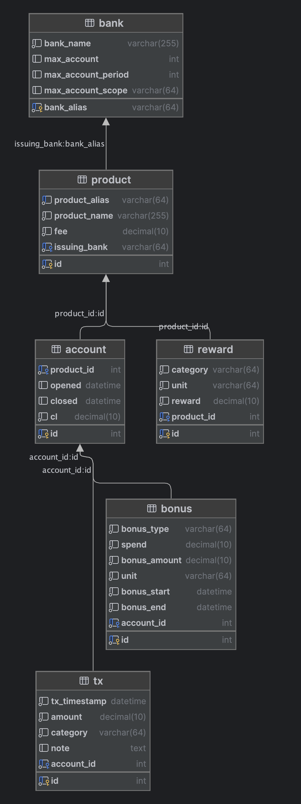

# Churn

[](https://builtwithnix.org)

## Technical Specifications

- **Language**: Go
- **Database**: MySQL or SQLite3 (depending on configuration, PostgreSQL "was" supported but abandoned)

## Installation

Minimal requirements:

- [Go 1.21.6](https://go.dev/dl): you can use the installers listed in the "Featured downloads" section to download the installer for your platform for easier setup
- Libraries specified in `go.mod`: links to the libraries are available in the `go.mod` file

Get the source code:

```shell
git clone https://github.com/stepbrobd/churn.git && cd churn
```

Build the project:

```shell
go build
```

The binary will be available at `./churn`.

To temporarily add `churn` to your `PATH`, run:

```shell
export PATH=$PATH:$(pwd)
```

For better experience, add the shell completion script (pick one depending on you shell):

```shell
source <(churn completion bash)
# or
source <(churn completion fish)
# or
source <(churn completion zsh)
```

After this, you can run `churn` and press `TAB` to see the available commands.

For example:

```shell
$ churn <TAB>
account     -- Manage accounts (add, delete, edit)
bank        -- Manage banks (add, delete, edit)
bonus       -- Manage bonuses (add, delete, edit)
completion  -- Generate the autocompletion script for the specified shell
help        -- Help about any command
migration   -- Manage database migrations
product     -- Manage product (add, delete, edit)
reward      -- Manage rewards (add, delete, edit)
stat        -- Show statistics
tx          -- Manage transactions (add, delete, edit)
```

## Configuration

Relevant code: [`internal/config/config.go`](internal/config/config.go)

By default, `churn` follows the XDG Base Directory Specification.
The configuration file is located at `$XDG_CONFIG_HOME/churn/churn.yaml` or `$HOME/.config/churn/churn.yaml`.

By default, `churn` uses SQLite3 as the database, and the database file is located at `$XDG_DATA_HOME/churn/churn.db` or `$HOME/.local/share/churn/churn.db`.
To use MySQL, set the the database driver to `mysql` and set the DSN to the MySQL connection string.

For example, to use MySQL, set the configuration file as follows:

```yaml
db:
  driver: mysql
  # if using mysql, you must provide a dsn
  # `parseTime=true` must be set to parse MySQL DATETIME values into Go time.Time
  # username is root, password is mysql, host is localhost, port is 3306, database is churn
  dsn: root:mysql@tcp(localhost:3306)/churn?parseTime=true
```

If you want to use SQLite3, the configuration is optional, and the default configuration is:

```yaml
db:
  driver: sqlite3
  # optional:
  dsn: file://~/.local/share/churn/churn.db
```

To make `churn` even more configurable, you can use environment variables to override the configuration file (environment variables have higher priority than the configuration file).

Available environment variables:

- `CHURN_CONFIG_PATH`: the configuration file path (default: `$HOME/.config/churn`)
- `CHURN_CONFIG_SRC`: the configuration file name (default: `churn.yaml`)
- `CHURN_DB_DRIVER`: the database driver (available values: `sqlite3`, `mysql`, default: `sqlite3`)
- `CHURN_DB_DSN`: the database connection string (default: `file://~/.local/share/churn/churn.db` for SQLite3, no default for MySQL)

To temporarily override the configuration file with environment variables, example:

```shell
CHURN_DB_DRIVER=mysql CHURN_DB_DSN=root:mysql@tcp(localhost:3306)/churn?parseTime=true churn <command>
```

## Static Content

In general, banks and product offerings are static and do not change frequently.

For the ease of use, users can import banks and products from a JSON file.

Local import:

```shell
churn bank import ./static/bank.json
# and/or
churn product import ./static/product.json
```

Remote import (hosted on <https://churn.cards>):

```shell
churn bank import https://churn.cards/bank.json
# and/or
churn product import https://churn.cards/product.json
```

See the files in the `static` directory for the JSON format.

## Conceptual Design

```txt
+---------+                        +---------+                +--------------------+
| Account | is a user account of > | Product | is issued by > | Bank               |
+---------+------------------------+---------+----------------+--------------------+
| id {PK} | 0..*            1..1   | id {PK} | 0..*    1..1   | id {PK}            |
| name    |                        | name    |                | name               |
| product |                        | fee     |                | max_acconut        |
| opened  |                        +--+------+                | max_acconut_period |
| closed  |                           |                       +--------------------+
| CL      |                           |
+----+----+------------+ 1..1         |
     | 1..1            |              | 1..1
     |                 |              |
     | have bonuses v  |              | have rewards v
     |                 |              |
     | 0..*            |              | 0..*
+----+----+            |         +----+-----+
| Bonus   |            |         | Reward   |
+---------+            | make v  +----------+
| id {PK} |            |         | id {PK}  |
| type    |            |         | category |
| spend   |            |         | unit     |
| bonus   |            |         | reward   |
| unit    |            |         +----------+
| start   |            |
| end     |            |
+---------+            | 0..*
                       +-------------+
                       | tx          |
                       +-------------+
                       | id {PK}     |
                       | timestamp   |
                       | amount      |
                       | category    |
                       | description |
                       +-------------+
```

Banks have products, products instantiate as accounts (multiple same products can be issued to the same user),
accounts have bonuses (varies between users), and products have rewards (same for all users).
Transactions are made by accounts and are used to track the user's spending and reward categories.

## Logical Design



Exported from DataGrip's ERD.

## User Flow

0. Configuration:
    - Database type (MySQL or SQLite3)
    - Database connection string (DSN)
    - Migration (use the built in migration tool if SQLite3 is used, use the example dump for MySQL)
1. Add a bank:
   - Bulk import for banks are available
   - `churn bank import <a local json or a remote json>`
2. Add a product:
   - Bulk import for products are available
   - `churn product import <a local json or a remote json>`
3. Add an account
4. Add a bonus (optional)
5. Add a reward (optional)
6. Add a transaction (optional)
7. Display statistics (optional)
8. Migrations (optional, not fully implemented, future work)

## [Onefetch](https://github.com/o2sh/onefetch)

```shell
           --==============--              Yifei Sun ~ git version 2.44.0
  .-==-.===oooo=oooooo=ooooo===--===-      ------------------------------
 .==  =o=oGGGGGGo=oo=oGGGGGGGG=o=  oo-     Project: churn (4 branches)
 -o= oo=G .=GGGGGo=o== .=GGGGG=ooo o=-     HEAD: bad453b (master, origin/master)
  .-=oo=o==oGGGGG=oo=oooGGGGGo=oooo.       Pending: 1+
   -ooooo=oooooo=.   .==ooo==oooooo-       Created: 2 months ago
   -ooooooooooo====_====ooooooooooo=       Languages:                            
   -oooooooooooo==#.#==ooooooooooooo                  ● Go (97.1 %) ● Nix (2.8 %)
   -ooooooooooooo=#.#=oooooooooooooo                  ● Dockerfile (0.1 %) 
   .oooooooooooooooooooooooooooooooo.      Author: 100% Yifei Sun 71
    oooooooooooooooooooooooooooooooo.      Last change: 25 seconds ago
  ..oooooooooooooooooooooooooooooooo..     URL: git@github.com:stepbrobd/churn
-=o-=ooooooooooooooooooooooooooooooo-oo.   Commits: 71
.=- oooooooooooooooooooooooooooooooo-.-    Churn (1): readme.md 1
   .oooooooooooooooooooooooooooooooo-      Lines of code: 2295
   -oooooooooooooooooooooooooooooooo-      Size: 4.01 MiB (58 files)
   -oooooooooooooooooooooooooooooooo-      
   -oooooooooooooooooooooooooooooooo-                              
   .oooooooooooooooooooooooooooooooo    
    =oooooooooooooooooooooooooooooo-    
    .=oooooooooooooooooooooooooooo-     
      -=oooooooooooooooooooooooo=.      
     =oo====oooooooooooooooo==-oo=-     
    .-==-    .--=======---     .==-
```

## License

The contents inside this repository, excluding all submodules, are licensed under the [MIT License](license.txt).
Third-party file(s) and/or code(s) are subject to their original term(s) and/or license(s).
